

# Wake

> [!NOTE]
> See [AI Usage](#ai-usage)
## Wake
A lightweight and highly configurable framework for Minecraft boatracing
- Supports: **Paper `1.21.x`, `26.x`**

  
  

## Feature Modules
Wake is a framework with isolated modules that can be toggled off

### Core Module
- Adds administration and utility commands
- The only module that cannot be toggled off
- see the [docs](#documentation)

### OBU Module
- Adds commands to configure boat physics via an [OpenBoatUtils](https://github.com/OpenBoatUtils/OpenBoatUtils) client
- Adds a custom command interface and features that OBU doesn't provide natively
  - Saving/loading preconfigured boat modes (contexts)
  - Immutable contexts you can layer and add temporary overrides to
  - Entity contexts (per boat settings) are easier to use via commands and sync to other players
  - Sandboxes that provide isolated environments to build contexts instead of using loose command block chains
  - A dashboard showing applied settings/contexts/overrides of boats and players
  - Listing default values for OBU settings
  - Clearing specific settings in your context rather than resetting or writing the default value
  - Keeping contexts across relogs and fixing boat lag on collisions (configurable)
  - etc.
- Supports OBU `0.5.0+`
- see the [docs](#documentation)

### Drydock Module
- Adds content for the Drydock boatracing server
- see the [docs](#documentation)

### Axiom Module
- Lets admins register namespaced item models in the create item display menu of Axiom
- see the [docs](#documentation)

## Showcase

  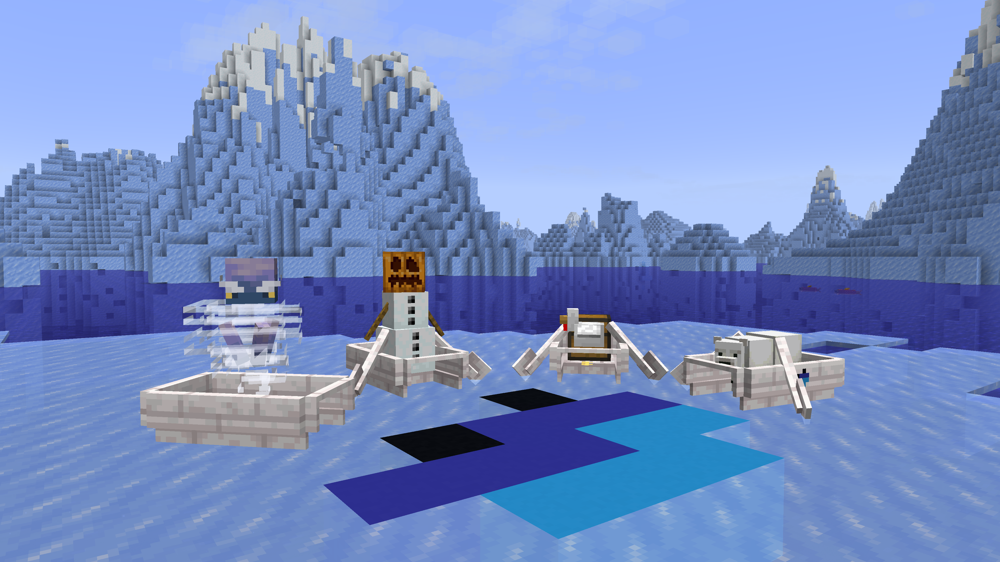

<b>OBU context layering</b>

**The status dashboard for OBU settings and contexts**

  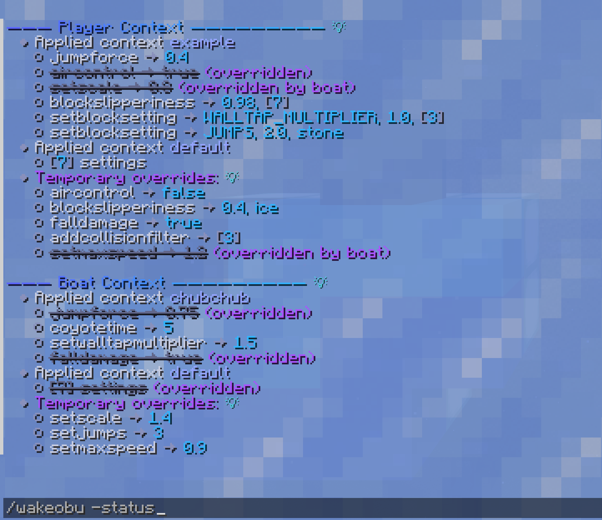
  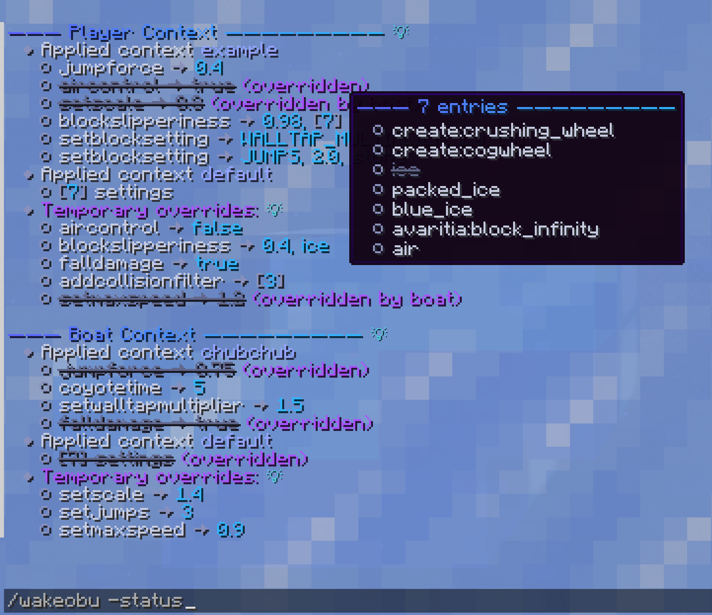

**Shared server contexts and your own sandboxes**

  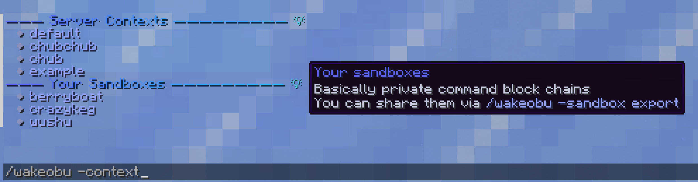
  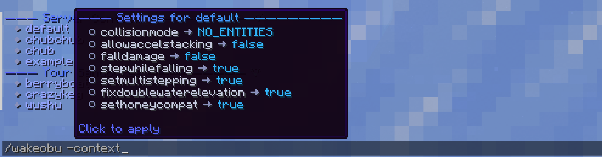

<b>Sandboxes</b>

**Two sample workflows:** Create, fork, switch and publish a sandbox. Add, narrow or remove single settings instead of resetting everything.

  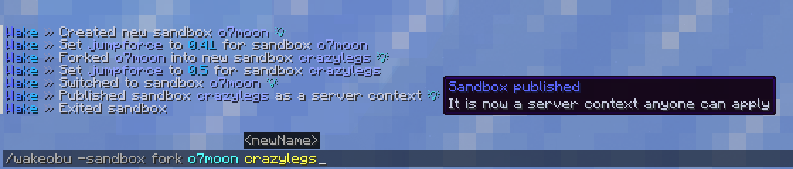
  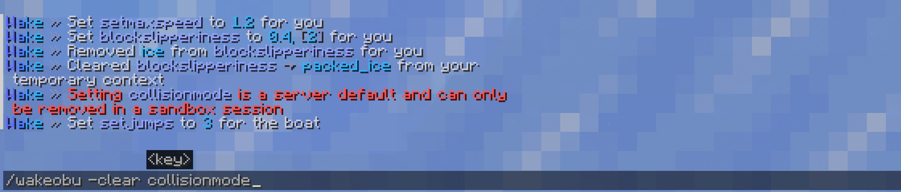

**Look up and share sandboxes**

  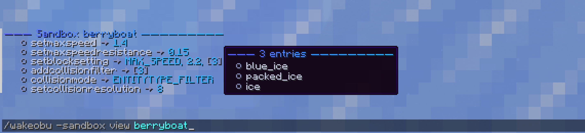
  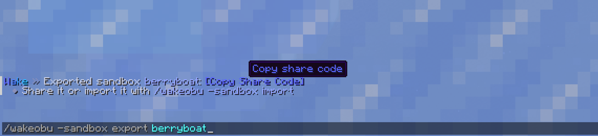

<b>More custom OBU features</b>

**Server-side settings for the OBU module**

  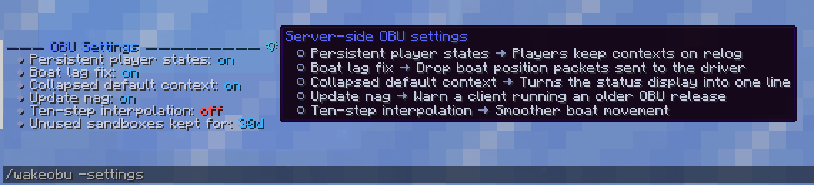

**Autocompletion and a command to look up OBU defaults**

  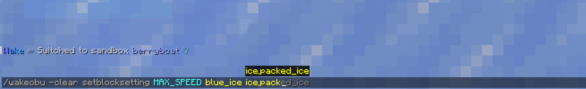
  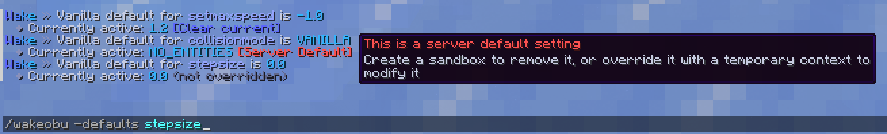

**All commands are listed and explained in custom help menus**

  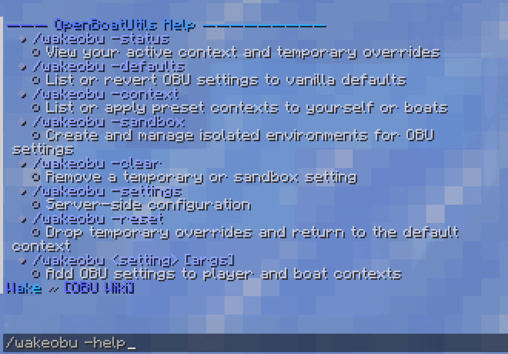
  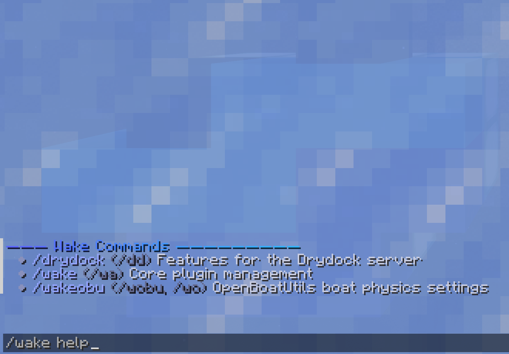

<b>More</b>

**OBU Client handling:** Outdated clients are notified and see badges on unavailable settings. Unsupported ones are refused.

  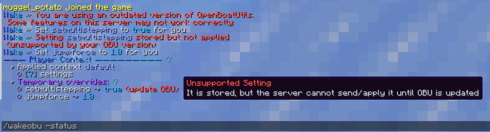
  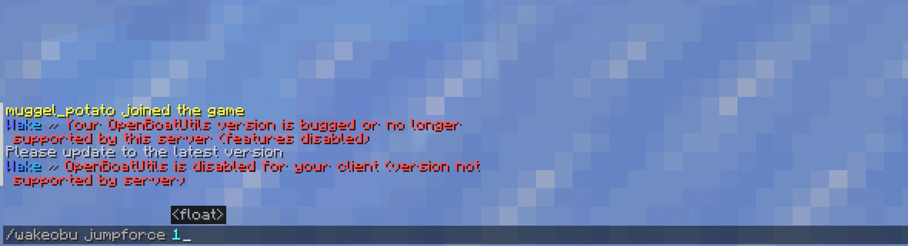

**Boostpads and durability:** Wake queues every change in case of database outages and replays them on recovery.

  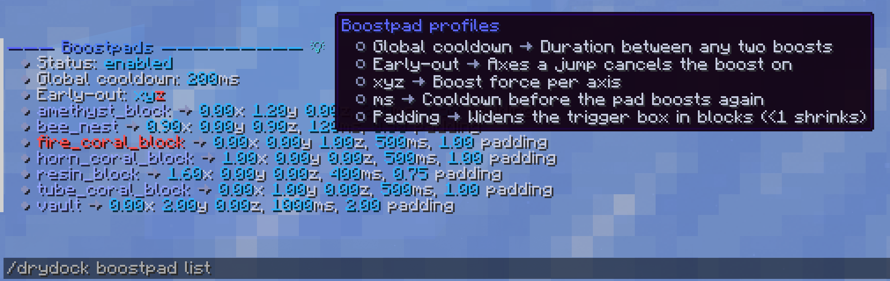
  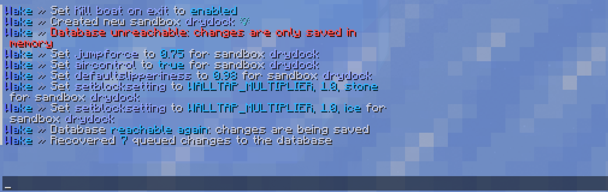

**Current modules in the reload dashboard**

  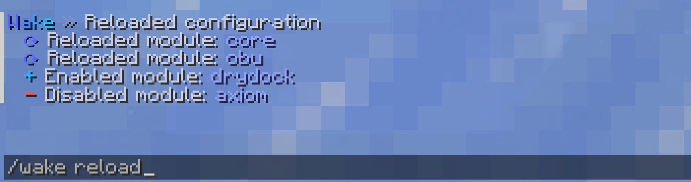

## Documentation

  

## AI Usage
Large parts of the codebase are written by or with the help of LLMs. They were used for code generation, reviews, drills and unit tests.  
While I use them heavily to generate boilerplate, the architectural/implementation decisions, ideas and code reviews are entirely my responsibility. For releases, I dedicate days to manual testing following iterative reviews and automated tests. See [PR #10](/../../pull/10): I spent 12 full days to review code, fix findings and run ~350 manual testcases on top of the automated ones for the 2.0.0 release.
I'm aware that using LLMs is a dealbreaker for some. But I can ensure you that Wake is properly tested and that I'm aware of my responsibilities using LLMs. I'm developing and sharing Wake as a passion project that smaller private servers like mine might benefit from as well. **Not critical infrastructure**.

## Developer & Admins
Wake is primarily developed and tested on Paper 1.21.11. 
It is compiled on all versions Wake claims to support. It is also sporadically tested on the lowest and highest supported versions but the majority of automated and manual testing will happen on the latest Minecraft version OBU supports.

### Database
By default Wake uses a **SQLite** database.  
You can set up a **MariaDB** database and point Wake to it via the [config](src/main/resources/config.yml). Wake automatically recovers after database outages and handles ingame notifications and cache reloading for you.

Wake caches gameplay related data in memory for instant access. Therefore the caches of individual servers can drift from the shared MariaDB database in a multi-server setup. Set up a **Valkey** instance and point Wake to it via the [config](src/main/resources/config.yml). Backends announce changes to their cache via **pub/sub** and Wake handles the invalidation/reloads so your backends stay synced if you choose to use that feature.

### Things you should know
Make sure to increase `moved-wrongly-threshold` and `moved-too-quickly-multiplier` in your `spigot.yml`

> [!Warning]
> Wake's OBU module cancels vehicle correction packets (VEHICLE_MOVE) for OBU clients in boats to avoid rubber banding when airstepping or at speed. Or anything that trips vanilla movement checks that isn't handled by the configs above.
> Make sure you account for that with a dedicated anti-cheat plugin or toggle it off via `/wakeobu -settings boat-lag-fix false`. 
> Private servers can ignore this warning.

1.21-1.21.3 will log a warning about EntityRemoveEvent which you can ignore (or suppress via `deprecated-verbose: false` in `bukkit.yml`)

## Credits
- [PaperMC](https://papermc.io/) provides the Paper API
- [PacketEvents](https://www.packetevents.com/) saves me from NMS packet manipulation
- [OpenBoatUtils](https://github.com/OpenBoatUtils/OpenBoatUtils) introduced me to a new genre of boatracing and inspired me to start working on Wake
- [@o7Moon](https://github.com/o7Moon) and [@microwavedram](https://github.com/microwavedram) for maintaining OBU
- [HikariCP](https://github.com/brettwooldridge/hikaricp) - [SQLite JDBC](https://github.com/xerial/sqlite-jdbc) - [MariaDB JDBC](https://github.com/mariadb-corporation/mariadb-connector-j) - [Lettuce](https://github.com/redis/lettuce) - [Aikar IDB](https://github.com/aikar/db)