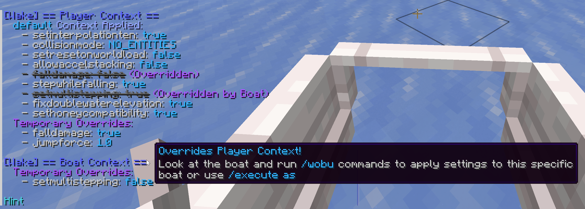
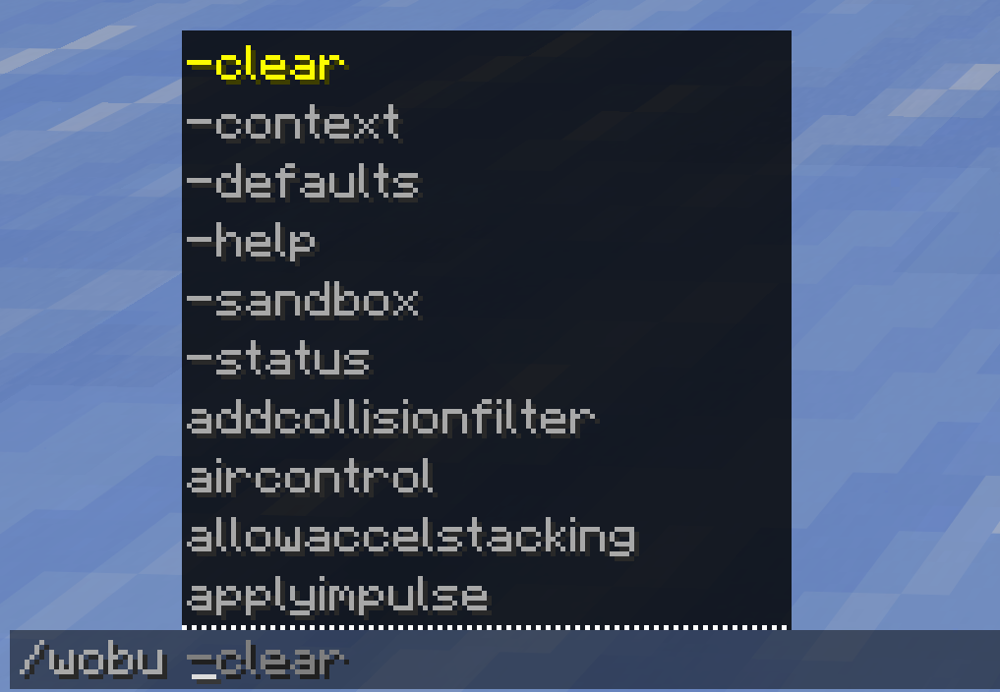
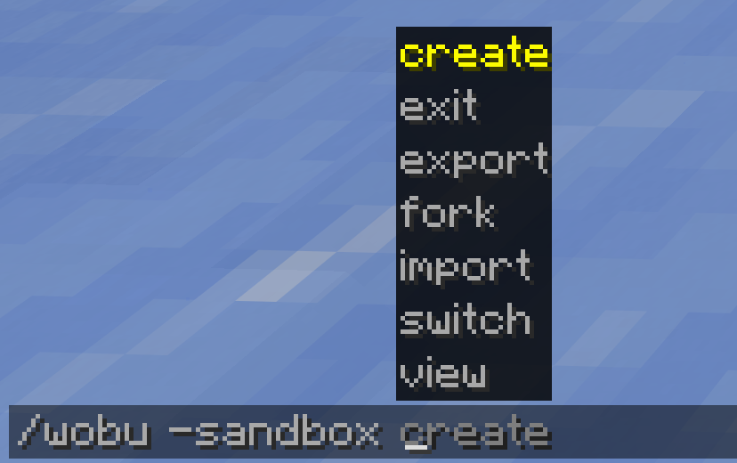
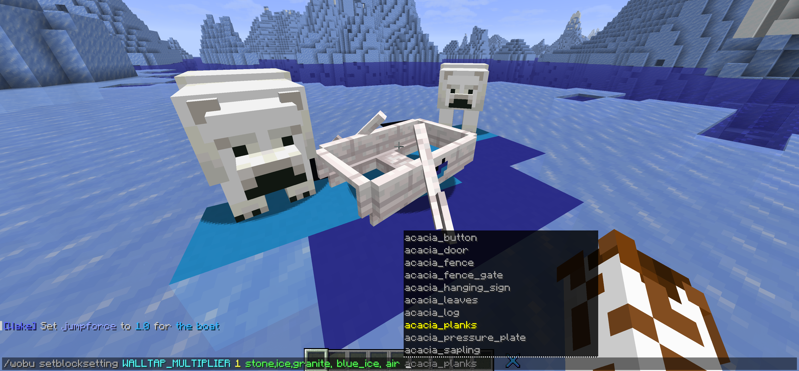
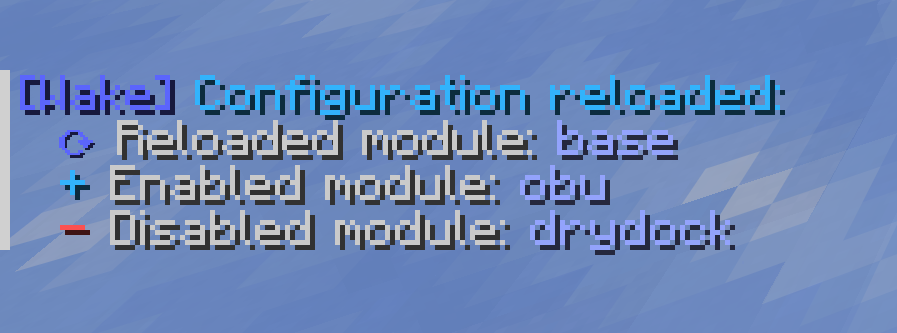

# Wake

> [!NOTE]
> Gemini 3.1 Pro & 3.5 Flash as well as CodeRabbit were used during development
## Wake
A lightweight and modular framework for Minecraft boatracing 
- Supported versions: **Paper `1.21.x`** 
- Download: [GitHub](https://github.com/muggelpotato/wake/releases) & Modrinth soon™ 

## Feature Modules
Wake is a framework with isolated modules that can be toggled off via the [config](src/main/resources/config.yml) if you don't need them (e.g. [Drydock](#drydock-module)) 
### Base Module
- Adds administration commands like: 
- `/wake:wa killboatonexit`
- `/wake:wa killemptyboats`
### OBU Module
- Adds commands to configure boat physics via the OBU client, like:
- `/wakeobu:wobu -context` to apply preset contexts
- `/wakeobu:wobu -sandbox` to work on custom contexts in an isolated environment
- `/wakeobu:wobu -status` to get a report detailing which contexts and settings apply or are being overridden by other settings
- `/wakeobu:wobu [obusetting] [args]` to apply temporary overrides to contexts
- see the documentation for all commands (soon™)
### Drydock Module
- Adds content for the Drydock boatracing server:
- Currently adds `/drydock:dd getboat` to get boats with custom models via [Drydock RSP](https://github.com/muggelpotato/drydock-resourcepack)
## Showcase

  
<b>Click to view more screenshots</b>
 
  <table>
    <tr>
      <td width="50%"></td>
      <td></td>
    </tr>
    <tr>
      <td></td>
      <td></td>
    </tr>
  </table>

## Developers
Wake was developed and tested on Paper 1.21.11
- Wake will only be actively developed and tested for one major Paper API version (feel free to fork)
### Architecture
Modular Monolith. Features are isolated into distinct modules
- [wake.core](src/main/java/dev/muggel/wake/core) provides shared, generic utilities that modules can and should use, like:
  - [WakeCommandBuilder](src/main/java/dev/muggel/wake/core/commands/WakeCommandBuilder.java) for Brigadier commands
  - [MessageManager](src/main/java/dev/muggel/wake/core/text/MessageManager.java) for fetching/parsing localized MiniMessages
  - [StateManager](src/main/java/dev/muggel/wake/core/config/StateManager.java) for simple persistent data handling
- Modules never directly import or reference concrete classes from one another. They communicate in two decoupled ways:
  - Data & API: [Wake.getServiceRegistry().get(OBUService.class)](src/main/java/dev/muggel/wake/Wake.java#L29-L31) for API calls like getBoatState
  - Event Bus: Modules listen for custom Bukkit Events from other modules rather than calling them directly to keep modules independent for reactive logic, like driving into a drydock powerup triggers an OBU context change
- Wake is event-driven where possible to avoid big impacts on server performance
- To add new feature modules, put your class in [wake.features](src/main/java/dev/muggel/wake/features), extend [AbstractModule](src/main/java/dev/muggel/wake/core/module/AbstractModule.java) and register it in [Wake](src/main/java/dev/muggel/wake/Wake.java).
  To ensure your module unloads gracefully without breaking the rest of the plugin when admins disable modules via the [config](src/main/resources/config.yml), put all your logic inside your module's package

Wake is designed to be as flexible and maintainable as possible (Zero [NMS](https://docs.papermc.io/paper/dev/internals/), standard Paper APIs, using [PacketEvents](https://github.com/retrooper/packetevents)). Please keep that in mind if you create pull requests
> [!Warning]
> Wake's OBU module intentionally bypasses server-side anticheat for simplicity by canceling vehicle correction packets (VEHICLE_MOVE) > [BoatLagInterceptor](src/main/java/dev/muggel/wake/features/obu/networking/interceptors/BoatLagInterceptor.java) 
> If you want to use Wake on a public server you would need to disable the OBU module or use a dedicated anti-cheat plugin

Proper documentation will be created eventually

## Development
Wake is primarily developed as a hobby project **for small hobby server projects** that need a plugin that just works 
- I'll prioritize simplicity and maintainability over, e.g., validating OBU vehicle movement via [NMS](https://docs.papermc.io/paper/dev/internals/) on the server
- If I think I could massively improve the plugin's architecture with a refactor like in https://github.com/muggelpotato/wake/pull/6, I'll also go ahead and prioritize code quality over backward compatibility 
Although I'm very happy with v1.0.1's state and probably won't introduce any major changes to the architecture for a very long time

## Credits
- [PaperMC](https://papermc.io/): For providing the Paper API that Wake makes use of
- [PacketEvents](https://www.packetevents.com/): For providing the NMS-free packet manipulation engine that Wake makes use of
- [OpenBoatUtils](https://github.com/OpenBoatUtils/OpenBoatUtils): The client-side mod that powers a big portion of Wake's features
- @microwavedram for implementing suggested OBU features that Wake will make use of and for giving me the idea of how to fix boatlag via [BoatLagInterceptor](src/main/java/dev/muggel/wake/features/obu/networking/interceptors/BoatLagInterceptor.java)
